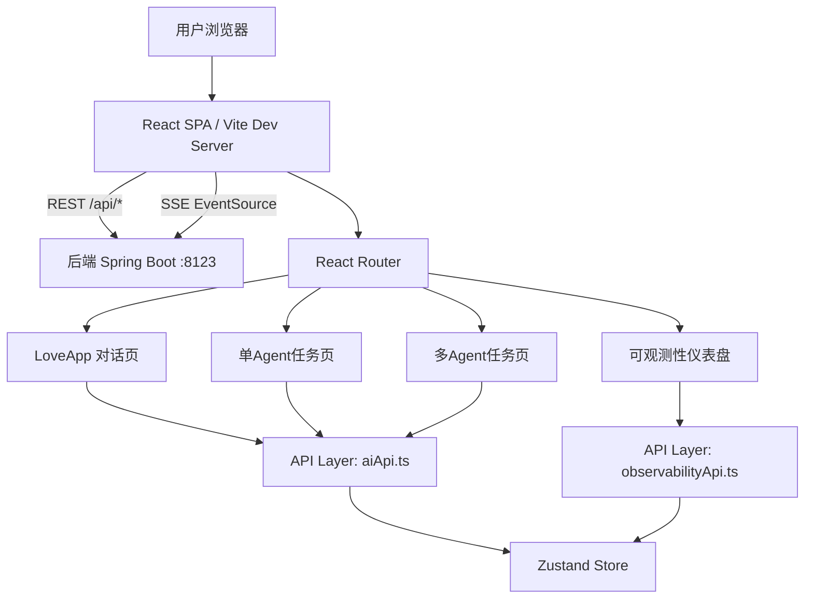

## 用户需求

为已完成的 axin-agent 后端平台开发一套配套的前端可视化界面，覆盖后端全部功能模块。

## 产品概览

axin-agent 前端是一个 AI Agent 管理与对话平台，后端服务运行在 `http://localhost:8123/api`，前端独立为新项目 `axin-agent-frontend`，通过 REST + SSE 与后端通信，为用户提供完整的 Agent 操控与可观测能力。

## 核心功能

### 1. 恋爱顾问对话模块

- 支持流式 SSE 对话，消息逐字输出效果
- 会话 ID 管理，多轮对话上下文保持
- 消息列表展示（用户/AI 气泡样式）

### 2. 单 Agent 任务控制台

- 输入框提交任务，调用 `POST /ai/manus/task/submit` 返回 taskId
- 实时订阅 SSE 进度流 `GET /ai/manus/task/progress/{taskId}`，逐行展示 Agent 步骤输出
- 任务状态标签（PENDING / RUNNING / FINISHED / ERROR / CANCELLED）
- 支持取消正在运行的任务
- 历史任务列表（分页，可点击查看详情）

### 3. 多 Agent 协作任务控制台

- 与单 Agent 同样的提交/进度/取消流程，调用 `POST /ai/orchestrator/task/submit`
- 进度流中可视化展示 PlannerAgent 规划阶段 + 各子 Agent 执行阶段

### 4. 可观测性仪表盘

- 全局 Metrics 卡片：总任务数、完成率、错误数、取消数、P95 延迟
- 工具调用成功率列表（toolMetrics）
- 按 taskId 查询任务 Trace：步骤时间线（Think/Act 步骤、工具名、耗时、成功/失败）
- Token 用量与费用估算面板（promptTokens / completionTokens / estimatedCostYuan）

### 5. 全局导航与状态

- 顶部导航栏，各模块快速切换
- 后端健康状态实时检测（`GET /health`）指示灯

## 技术栈

- **框架**: React 18 + TypeScript
- **构建工具**: Vite 5
- **UI 组件库**: shadcn/ui（基于 Radix UI + Tailwind CSS）
- **路由**: React Router v6
- **状态管理**: Zustand（轻量，适合中小规模）
- **HTTP 客户端**: Axios（REST 请求）+ 原生 `EventSource` / `fetch` SSE（流式订阅）
- **图表**: Recharts（Metrics 仪表盘用）
- **时间处理**: dayjs

---

## 实现方案

### 整体策略

前端采用 SPA 架构，Vite 开发服务器配置代理将 `/api` 转发至 `http://localhost:8123`，消除跨域问题。页面按功能模块拆分为独立路由页面，共用底层 API 封装层和 SSE Hook。

### 关键技术决策

1. **SSE 流接入**: 使用自定义 `useSSE` Hook 封装 `EventSource`，统一处理连接、消息推送、错误、重连与手动关闭生命周期；流式对话（LoveApp）使用 `fetch` + `ReadableStream` 解析 `text/event-stream` 实现打字机效果。

2. **API 层封装**: 新建 `src/api/` 按模块分文件（`aiApi.ts` / `observabilityApi.ts`），统一处理 `BaseResponse<T>` 的解包和错误码，避免页面层重复处理。

3. **状态管理**: 任务列表、当前任务状态、Metrics 数据放入 Zustand Store；对话消息列表用组件内 `useState` 管理，避免过度全局化。

4. **Trace 时间线**: TraceStepEntry 按 step 排序后渲染为垂直时间线，用颜色区分 THINK/ACT 步骤类型和成功/失败状态。

### 性能考量

- SSE 连接在组件卸载时必须调用 `emitter.close()`，防止内存泄漏
- 历史任务列表使用后端分页，不在前端做全量加载
- Metrics 仪表盘定时轮询（30s），轮询间隔可配置

---

## 架构设计



---

## 目录结构

```
axin-agent-frontend/
├── public/
├── src/
│   ├── api/
│   │   ├── aiApi.ts               # [NEW] 封装 AiController 所有接口：LoveApp 对话、Manus 任务提交/查询/取消/历史、Orchestrator 任务提交
│   │   ├── observabilityApi.ts    # [NEW] 封装 ObservabilityController 接口：trace/metrics/cost
│   │   └── http.ts                # [NEW] Axios 实例，统一 baseURL、拦截器、BaseResponse 解包
│   ├── hooks/
│   │   ├── useSSE.ts              # [NEW] 通用 SSE Hook，封装 EventSource 生命周期，支持手动关闭
│   │   └── useTaskProgress.ts    # [NEW] 订阅任务进度 SSE，维护步骤列表 + 任务状态
│   ├── store/
│   │   ├── taskStore.ts           # [NEW] Zustand：任务列表、当前任务状态
│   │   └── metricsStore.ts        # [NEW] Zustand：全局 Metrics 数据缓存
│   ├── pages/
│   │   ├── LoveAppPage.tsx        # [NEW] 恋爱顾问页：流式 SSE 对话，打字机效果，会话管理
│   │   ├── ManusTaskPage.tsx      # [NEW] 单 Agent 任务页：提交、SSE 进度流、状态标签、取消、历史列表
│   │   ├── OrchestratorTaskPage.tsx # [NEW] 多 Agent 协作页：同 ManusTask，附规划阶段进度可视化
│   │   └── ObservabilityPage.tsx  # [NEW] 可观测性仪表盘：Metrics 卡片、工具成功率、Trace 时间线、Cost 面板
│   ├── components/
│   │   ├── layout/
│   │   │   ├── AppLayout.tsx      # [NEW] 整体布局：顶部导航 + 侧边栏 + 内容区
│   │   │   └── NavBar.tsx         # [NEW] 顶部导航：Logo、路由链接、健康状态指示灯
│   │   ├── chat/
│   │   │   ├── MessageList.tsx    # [NEW] 消息气泡列表，区分用户/AI 角色，Markdown 渲染
│   │   │   └── ChatInput.tsx      # [NEW] 输入框组件，支持 Enter 发送、发送中禁用
│   │   ├── task/
│   │   │   ├── TaskSubmitForm.tsx # [NEW] 任务提交表单，模式选择（SINGLE/MULTI）
│   │   │   ├── TaskProgressPanel.tsx # [NEW] SSE 进度面板，逐步展示 Agent 输出，自动滚动到底部
│   │   │   ├── TaskStatusBadge.tsx   # [NEW] 任务状态徽章，颜色编码五种状态
│   │   │   └── TaskHistoryTable.tsx  # [NEW] 任务历史分页表格，支持点击查看 Trace
│   │   └── observability/
│   │       ├── MetricsCards.tsx   # [NEW] Metrics 汇总卡片（总数/完成率/错误/P95）
│   │       ├── ToolMetricsTable.tsx  # [NEW] 工具调用成功率表格
│   │       ├── TraceTimeline.tsx  # [NEW] Trace 步骤时间线：THINK/ACT 区分，耗时 bar
│   │       └── CostPanel.tsx      # [NEW] Token 用量与费用估算展示
│   ├── types/
│   │   └── api.ts                 # [NEW] 前端 TS 类型定义，对应后端 VO（AgentTaskStatus、MetricsResult、TaskTraceResult 等）
│   ├── utils/
│   │   └── format.ts              # [NEW] 时间格式化、Token 数字格式化、状态文本映射工具函数
│   ├── App.tsx                    # [NEW] 路由根组件
│   ├── main.tsx                   # [NEW] React 应用入口
│   └── index.css                  # [NEW] Tailwind 基础样式
├── index.html
├── vite.config.ts                 # [NEW] Vite 配置，含 /api 代理到 localhost:8123
├── tailwind.config.ts             # [NEW] Tailwind 配置
├── tsconfig.json
└── package.json
```

## 设计风格

采用深色科技感 Glassmorphism 风格，契合 AI Agent 平台的专业定位。整体以深灰/深蓝黑为背景，卡片使用半透明毛玻璃效果，主色调为霓虹青蓝，搭配紫色渐变点缀，呈现出类 LangSmith / Dify 的专业 AI 工具平台气质。

## 页面设计

### 1. 整体布局（AppLayout）

- **顶部导航栏**：深色半透明背景，左侧 Logo（渐变文字"AxinAgent"），中部导航 Tab（恋爱顾问 / 单 Agent / 多 Agent 协作 / 可观测性），右侧健康状态绿色/红色脉冲指示灯
- **内容区**：全屏高度，各页面填充

### 2. 恋爱顾问页（LoveAppPage）

- **顶部会话栏**：会话 ID 显示 + 新建对话按钮
- **消息列表区**：滚动区域，用户消息右对齐深色气泡，AI 消息左对齐渐变蓝紫气泡，流式输出时末尾显示光标闪烁动画
- **底部输入区**：毛玻璃输入框 + 发送按钮（发送中旋转动画），支持 Enter 发送
- **侧边 RAG 模式切换**：LOCAL / CLOUD 标签切换

### 3. 单/多 Agent 任务页（ManusTaskPage / OrchestratorTaskPage）

- **顶部提交区**：大文本框（支持多行）+ 提交按钮，多 Agent 页额外显示"任务规划"徽章
- **进度面板**：毛玻璃卡片，步骤逐行追加，THINK 步骤左侧蓝色圆点，ACT 步骤左侧紫色圆点，工具名高亮标签，成功/失败图标，实时滚动
- **状态栏**：任务 ID、状态徽章、耗时、取消按钮
- **历史列表**：下方分页表格，列：任务ID / 模式 / 状态 / 创建时间 / 操作，点击查看 Trace

### 4. 可观测性仪表盘（ObservabilityPage）

- **Metrics 卡片区**：4 个大数字卡片（总任务 / 完成率 / 错误 / P95延迟），渐变边框
- **工具成功率**：横向进度条列表，颜色编码成功率高低
- **Trace 查询区**：taskId 输入框 + 查询按钮，下方垂直时间线，每步展示：步骤编号、类型标签、工具名、摘要、耗时进度条
- **Cost 面板**：Prompt/Completion Token 数量 + 总费用人民币，Recharts 饼图展示 Token 分布

## Agent Extensions

### Skill

- **frontend-design**
- Purpose: 生成具有高设计质量的前端界面代码，用于各核心页面（LoveAppPage、ManusTaskPage、OrchestratorTaskPage、ObservabilityPage）及公共组件（AppLayout、TaskProgressPanel、TraceTimeline）
- Expected outcome: 输出符合 Glassmorphism 深色科技风格的 React + Tailwind + shadcn/ui 组件代码，视觉精美，可直接集成到项目中

- **ui-ux-pro-max**
- Purpose: 在可观测性仪表盘（ObservabilityPage）和 Metrics 卡片设计中提供专业 UI/UX 决策，确保数据可视化布局合理、信息层次清晰
- Expected outcome: 产出专业级仪表盘 UI 方案，包含图表布局、配色、交互细节

### SubAgent

- **code-explorer**
- Purpose: 在开发过程中精准搜索后端 VO 类型、API 响应结构等，确保前端类型定义（types/api.ts）与后端完全一致
- Expected outcome: 提供准确的字段名称、数据类型，避免前后端数据结构不匹配