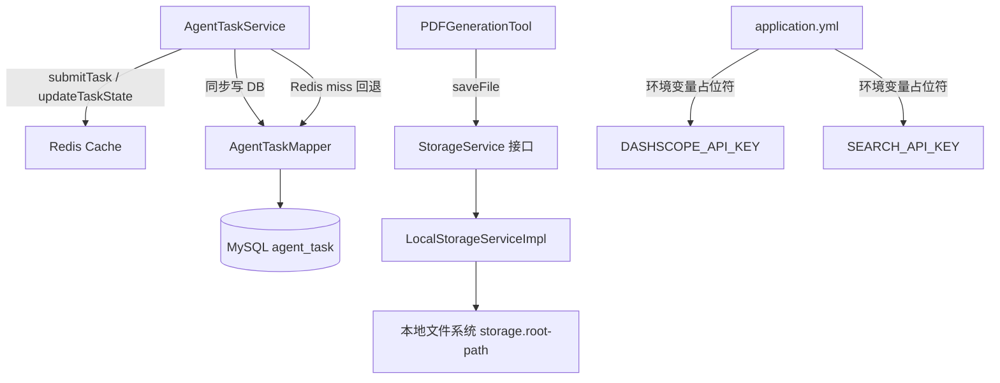

## 用户需求

根据 `future.md` 3.1 架构总览，完成**基础设施层（Infrastructure Layer）**的建设，可引入新依赖，不需要关注"用户"和"限流"相关功能。

## 产品概述

基础设施层是整个生产级 Agent 平台的底座，为上层任务调度层、Agent 执行层提供稳定可靠的数据持久化、文件存储和安全配置能力。

## 核心功能

### 1. 关系型数据库（MySQL + MyBatis-Plus）

- 引入 MySQL 数据源和 MyBatis-Plus，建立 `agent_task` 任务表
- 字段涵盖：task_id、state、message、mode、create_time、update_time、error_message、result
- `AgentTaskService` 在提交任务、更新状态时同步写入 DB，使任务历史永久可查（不再依赖 1 小时 TTL 的 Redis 短存）
- 新增任务历史列表查询接口（按时间倒序分页）

### 2. 对象存储服务（StorageService 抽象）

- 定义 `StorageService` 接口，方法：`saveFile(category, filename, bytes) → 访问路径`、`getFilePath(category, filename) → 本地绝对路径`
- 提供 `LocalStorageServiceImpl` 本地文件系统实现，存储根路径配置化（`application.yml`）
- `PDFGenerationTool` 改为注入 `StorageService`，移除硬编码路径 `./tmp/pdf/`

### 3. API Key 安全配置

- `application.yml` 中 `dashscope.api-key` 和 `search-api.api-key` 明文改为环境变量占位符格式 `${DASHSCOPE_API_KEY:原值}` 和 `${SEARCH_API_KEY:原值}`，本地开发保留默认值，生产环境通过环境变量注入

## 技术栈

- **框架**：Spring Boot 3.5.12 + Java 21（现有）
- **ORM**：MyBatis-Plus 3.5.10（引入）
- **数据库**：MySQL 8.x（引入驱动 `mysql-connector-j`，Spring Boot 管理版本）
- **连接池**：HikariCP（Spring Boot 默认，无需单独引入）
- **现有**：Spring Data Redis、RocketMQ、Lombok、Hutool

---

## 实现思路

### 关系型 DB 持久化

采用 **Redis 热数据 + MySQL 冷存储双写** 策略：任务提交和状态变更时，Redis 继续承担高频实时查询（毫秒级响应给 SSE 进度轮询），同时异步/同步写 MySQL 做永久存档。

- `submitTask` 写 Redis + 同步写 DB（INSERT）
- `updateTaskState` 写 Redis + 同步更新 DB（UPDATE state/error_message/update_time）
- 查询任务状态：优先走 Redis，Redis miss 时回退查 DB（防止 TTL 过期后 404）
- 新增历史列表接口走 DB 分页查询

这样改动最小，不破坏现有 SSE 进度推送流程（继续走 Redis List），仅在写入点增加 DB 调用。

### 对象存储抽象

引入 `StorageService` 接口 + `LocalStorageServiceImpl`，遵循接口隔离原则，后续可无缝替换 OSS/MinIO 实现。`PDFGenerationTool` 改为 Spring Bean（`@Component`），注入 `StorageService`，返回路径改为 `StorageService` 计算的标准路径。

### 安全配置

仅修改 `application.yml`，采用 `${ENV_VAR:default_value}` 格式，向下兼容本地开发直接启动。

---

## 实现注意事项

1. **双写一致性**：Redis 和 MySQL 写入均为同步调用，无需事务（Redis 非事务型），若 MySQL 写失败仅打日志不影响主流程（任务依然正常投递 RocketMQ）
2. **Redis 回退查 DB**：`getTaskStatus` 中当 Redis entries 为空时，查 DB 并回填 Redis（设置 TTL 避免雪崩），实现透明的缓存穿透保护
3. **MyBatis-Plus 实体**：使用 `@TableId(type = IdType.INPUT)` 指定业务主键 task_id（非自增）；`@TableLogic` 非必须（任务不做软删）
4. **PDFGenerationTool Bean 化**：原为普通类（非 Spring Bean），需改为 `@Component` 并移除 static 字段，`ToolRegistration` 处对应调整
5. **SQL 初始化**：提供 `schema.sql`，Spring Boot 配置 `spring.sql.init.mode=never`（手动执行），避免每次启动重建表

---

## 架构设计



---

## 目录结构

```
src/main/java/com/axin/axinagent/
├── infrastructure/
│   ├── storage/
│   │   ├── StorageService.java                  # [NEW] 对象存储接口：saveFile / getFilePath
│   │   └── LocalStorageServiceImpl.java         # [NEW] 本地文件系统实现，读取 storage.root-path 配置
│   └── db/
│       ├── entity/
│       │   └── AgentTaskEntity.java             # [NEW] MyBatis-Plus 实体，映射 agent_task 表
│       └── mapper/
│           └── AgentTaskMapper.java             # [NEW] MyBatis-Plus BaseMapper<AgentTaskEntity>
├── task/
│   └── AgentTaskService.java                    # [MODIFY] submitTask/updateTaskState/getTaskStatus 增加 DB 双写和回退逻辑；新增 listTaskHistory 分页查询
├── tool/
│   └── PDFGenerationTool.java                   # [MODIFY] 改为 @Component，注入 StorageService，移除硬编码路径
├── controller/
│   └── AiController.java                        # [MODIFY] 删除重复类定义（文件中有两个 AiController 类），新增 listTaskHistory 接口
└── config/
    └── MyBatisPlusConfig.java                   # [NEW] 配置 MyBatis-Plus 分页插件、Mapper 扫描路径

src/main/resources/
├── application.yml                              # [MODIFY] API Key 改为环境变量占位符；增加 MySQL 数据源和 storage 配置
├── mapper/
│   └── AgentTaskMapper.xml                      # [NEW] 可选，简单 CRUD 直接用 BaseMapper，此处备用
└── db/
    └── schema.sql                               # [NEW] agent_task 建表 SQL（手动执行）

pom.xml                                          # [MODIFY] 引入 MyBatis-Plus、MySQL Driver 依赖
```

---

## 关键代码结构

```java
// StorageService.java - 核心接口
public interface StorageService {
    /** 保存文件，返回相对访问路径 */
    String saveFile(String category, String filename, byte[] content) throws IOException;
    /** 获取文件本地绝对路径 */
    String getFilePath(String category, String filename);
}

// AgentTaskEntity.java - 关键字段
@TableName("agent_task")
public class AgentTaskEntity {
    @TableId(type = IdType.INPUT)
    private String taskId;
    private String state;      // AgentState.name()
    private String message;
    private String mode;       // SINGLE / MULTI
    private String errorMessage;
    private String result;     // 任务最终输出（可为 null）
    private LocalDateTime createTime;
    private LocalDateTime updateTime;
}
```

## Agent 扩展

### SubAgent

- **code-explorer**
- 用途：在执行任务 2（AgentTaskService 双写改造）时，探索 AgentTaskService、AgentTaskConsumer、RocketMqConfig 之间的完整调用链，确保 DB 写入点覆盖所有状态变更路径
- 预期结果：精准定位所有需要插入 DB 调用的方法，避免遗漏 CANCELLED / TIMEOUT 等状态更新路径