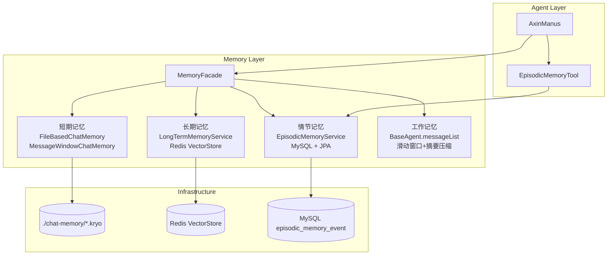

## 用户需求

根据 `future.md` 第 3.1 节生产级 Agent 架构图，实现完整的**记忆层（Memory Layer）**，涵盖四种记忆类型的全面完善。情节记忆使用 MySQL 作为持久化存储。

## 产品概述

在现有 axin-agent 项目基础上，构建生产级四层记忆体系，使 Agent 具备短期会话保持、长期知识检索、情节事件归档、工作上下文管理的完整记忆能力。

## 核心功能

### 1. 短期记忆（完善）

- `FileBasedChatMemory` 已实现并在 LoveApp 启用，状态良好
- 将短期记忆能力通用化，封装 `MemoryConfig` 统一管理 Bean，供全局复用
- `MessageWindowChatMemory`（窗口大小 20）作为标准短期记忆方案

### 2. 长期记忆（扩展）

- 当前 RAG 仅限 LoveApp 使用，需将向量化长期记忆能力提升为全局可用
- 新增 `LongTermMemoryService`，支持任意 Agent 写入重要对话片段到 Redis 向量库
- 支持按 `userId` / `agentName` 元数据过滤检索，实现跨会话的语义记忆检索

### 3. 情节记忆（新建）

- 使用 MySQL + Spring Data JPA 实现结构化事件存储
- `EpisodicMemoryEvent` 实体：记录 agentName、userId、eventType、summary、keywords、importance（重要性评分）、createdAt
- `EpisodicMemoryService`：提供记录事件、按用户/Agent 查询、按关键词搜索、按重要性排序等能力
- `EpisodicMemoryTool`：将情节记忆封装为 Agent 可调用的工具，Agent 可主动保存和检索历史重要事件

### 4. 工作记忆（完善）

- `BaseAgent.messageList` 滑动窗口已实现（`maxMessageWindowSize=40`），保持现状
- 新增**摘要压缩**机制：当消息超过窗口时，调用 LLM 对被截断部分生成摘要注入，防止上下文信息硬性丢失
- 在 `BaseAgent` 中新增 `workingMemorySummary` 字段，截断时自动触发摘要并以 SystemMessage 形式注入

### 5. 统一记忆门面（新建）

- `MemoryFacade`：统一封装四种记忆类型，提供 Agent 一站式记忆读写接口
- `AxinManus` 接入情节记忆工具，使超级 Agent 具备主动保存和检索重要事件的能力

## 技术栈

- **框架**：Spring Boot 3.5 + Spring AI 1.1.2 + Spring Data JPA
- **数据库**：MySQL 8.x（情节记忆）+ Redis（短期文件序列化 + 长期向量检索，已有）
- **ORM**：Hibernate（Spring Data JPA 内置）
- **序列化**：Kryo 5.6.2（已有，FileBasedChatMemory）
- **向量库**：spring-ai-starter-vector-store-redis（已有）
- **新增依赖**：`spring-boot-starter-data-jpa`、`mysql-connector-j`

---

## 实现思路

### 整体策略

采用**分层扩展**策略，在不破坏现有代码的前提下：

1. 短期记忆和工作记忆以**增强现有能力**为主（工作记忆增加摘要压缩）
2. 长期记忆以**提取公共化**为主（从 LoveApp 专属提升为全局 Service）
3. 情节记忆从零新建，基于 JPA + MySQL，并封装为 Agent 工具
4. 最终用 `MemoryFacade` 统一门面，降低 Agent 层使用复杂度

### 关键技术决策

**情节记忆为何封装为 Tool？**
Agent（AxinManus）通过 ReAct 循环调用工具，将情节记忆封装成 `EpisodicMemoryTool` 后，Agent 可以在任意步骤主动决策「保存这件事」或「查询历史事件」，而无需在代码层硬编码触发时机，符合 Agent 自主决策的设计原则。

**长期记忆扩展为什么不改 LoveApp？**
新建 `LongTermMemoryService` 作为独立 Spring Bean，LoveApp 继续使用其现有的 RAG Advisor（保持向后兼容），同时 AxinManus 等其他 Agent 可通过 Service 直接操作向量库写入/检索，两条路并行不干扰。

**工作记忆摘要压缩的触发时机**
在 `BaseAgent.trimMessageList()` 中，截断前先异步调用 LLM 对即将被移除的消息批次生成摘要，以 `SystemMessage` 形式插入到保留列表的头部（第2条），确保 LLM 始终有「已发生内容」的语义感知，而不是硬切断。

---

## 架构设计



---

## 实现说明

- **向后兼容**：LoveApp 现有构造和方法不做任何改动，新能力通过新增 Bean/Service 的方式扩展
- **JPA 表初始化**：使用 `spring.jpa.hibernate.ddl-auto=update` 自动建表，无需手写 SQL 脚本
- **情节记忆表字段**：`id(bigint PK auto)`, `agent_name(varchar)`, `user_id(varchar)`, `event_type(varchar)`, `summary(text)`, `keywords(varchar)`, `importance(int)`, `created_at(datetime)`
- **LongTermMemoryService 向量写入**：Document 携带 metadata（userId、agentName、source=long_term），通过 VectorStore.add() 写入；检索时使用 SearchRequest 的 filterExpression 过滤
- **EpisodicMemoryTool 工具签名**：两个 @Tool 方法——`saveEpisodicMemory(agentName, userId, eventType, summary, keywords, importance)` 和 `searchEpisodicMemory(userId, keyword, limit)`
- **MemoryFacade 不引入强依赖**：对 LoveApp 不注入，仅供 Agent 层（AxinManus）和新业务使用

---

## 目录结构

```
src/main/java/com/axin/axinagent/
├── chatmemory/
│   └── FileBasedChatMemory.java          [已有，不改动]
├── memory/
│   ├── LongTermMemoryService.java         [NEW] 长期记忆服务。封装 Redis VectorStore 的写入与语义检索，支持按 userId/agentName 元数据过滤。提供 store(userId, agentName, content) 和 search(userId, query, topK) 方法。
│   ├── EpisodicMemoryEvent.java           [NEW] 情节记忆 JPA 实体。字段：id, agentName, userId, eventType, summary, keywords, importance(1-10), createdAt。使用 @Entity @Table(name="episodic_memory_event")。
│   ├── EpisodicMemoryRepository.java      [NEW] Spring Data JPA Repository。继承 JpaRepository<EpisodicMemoryEvent, Long>，定义按 userId 查询、按 keyword LIKE 搜索、按 importance 排序的方法。
│   ├── EpisodicMemoryService.java         [NEW] 情节记忆服务。封装 Repository，提供 saveEvent()、findByUserId()、searchByKeyword()、findTopImportantEvents() 方法，供 Tool 和外部调用。
│   └── MemoryFacade.java                  [NEW] 统一记忆门面。聚合短期/长期/情节三种记忆服务，提供 Agent 层统一调用入口（工作记忆由 BaseAgent 自管理，不纳入 Facade）。
├── tool/
│   ├── EpisodicMemoryTool.java            [NEW] 情节记忆工具。包含两个 @Tool 方法：saveEpisodicMemory（保存重要事件）和 searchEpisodicMemory（检索历史事件），注册到 AxinManus 工具列表。
│   └── ToolRegistration.java              [MODIFY] 在 allTools() Bean 中追加 EpisodicMemoryTool 实例注册。
├── agent/
│   └── BaseAgent.java                     [MODIFY] 在 trimMessageList() 方法中增加摘要压缩逻辑：截断前用 ChatClient 生成 summary，以 SystemMessage("历史摘要: ...") 插入保留列表首部。新增 summarizeEnabled 开关（默认 true）。
└── config/
    └── MemoryConfig.java                  [NEW] 记忆层统一配置类。将 FileBasedChatMemory + MessageWindowChatMemory 声明为 @Bean，供全局注入复用（LoveApp 现有构造保持不变，后续新组件通过 @Resource 注入）。

src/main/resources/
└── application.yml                        [MODIFY] 新增 spring.datasource（MySQL url/username/password）和 spring.jpa 配置（ddl-auto=update, show-sql=true, dialect=MySQL8Dialect）。
pom.xml                                    [MODIFY] 新增 spring-boot-starter-data-jpa 和 mysql-connector-j 依赖。
```

## Agent Extensions

### SubAgent

- **code-explorer**
- Purpose: 深入探索现有 rag/、agent/、tool/ 目录的实现细节，确认 VectorStore 注入方式、ToolRegistration 扩展点、BaseAgent 修改影响范围
- Expected outcome: 确认 LongTermMemoryService 中 VectorStore 可直接 @Resource 注入、EpisodicMemoryTool 在 ToolRegistration 中的正确注册方式