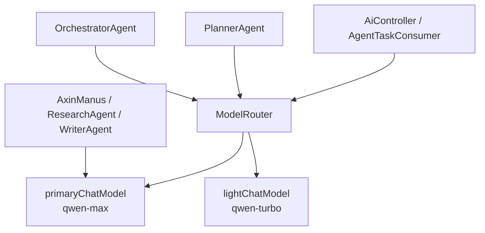

## 用户需求

根据 `future.md` 3.1 架构总览中的**模型层 (LLM)** 设计，完整实现模型层能力，支持引入依赖。

## 产品概述

在现有项目的基础上，新增模型层抽象，将当前硬编码的单一 DashScope 模型调用升级为支持**主力模型（qwen-max）**和**轻量模型（qwen-turbo）**的双模型体系，并通过模型路由器统一管理。各 Agent 根据任务类型自动选用合适的模型，实现成本优化与性能平衡。

## 核心功能

- **双模型配置**：在 `application.yml` 新增主力模型（qwen-max）和轻量模型（qwen-turbo）独立配置项，支持各自的温度、超时、最大 token 等参数
- **ModelType 枚举**：定义 `PRIMARY`（主力模型，用于复杂推理/Agent Think-Act）和 `LIGHT`（轻量模型，用于任务分类/意图路由/规划）两种模型类型
- **ModelRouter 路由器**：Spring Bean，根据 ModelType 返回对应的 `ChatModel`，统一入口，支持按类型获取
- **PlannerAgent 使用轻量模型**：任务规划、分解属于结构化输出任务，改用轻量模型降低成本
- **ToolCallAgent options 解耦**：将硬编码的 `DashScopeChatOptions.builder().build()` 改为通过 `ModelRouter` 获取对应 options，支持主力/轻量模型差异化配置
- **future.md 更新**：将模型层实现状态标记为已完成

## 技术栈

- Spring Boot 3.5 + Spring AI 1.1.2 + DashScope（`spring-ai-alibaba-starter-dashscope` 已引入）
- DashScope 多模型：`qwen-max`（主力）、`qwen-turbo`（轻量）
- Lombok + `@ConfigurationProperties` 绑定配置
- 无需新增外部依赖，利用 DashScope starter 的 `DashScopeChatModel` 和 `DashScopeChatOptions` 即可完成双模型实例化

## 实现思路

### 核心策略

通过 Spring `@Configuration` 手动注册两个 `ChatModel` Bean（分别命名 `primaryChatModel` 和 `lightChatModel`），利用 `DashScopeChatModel` 构造时传入不同 `DashScopeConnectionProperties`（API Key）和 `DashScopeChatOptions`（model 名称、temperature、maxTokens）来区分主力/轻量模型。`ModelRouter` 作为统一门面，持有两个 Bean，按 `ModelType` 分发。

### 关键决策

1. **不使用 Auto-configuration 的默认 ChatModel Bean**：项目当前所有 Agent 注入的 `ChatModel dashscopeChatModel` 是 DashScope starter 自动注册的 Bean（默认读 `spring.ai.dashscope`）。为保持向后兼容，`primaryChatModel` 复用同一 API Key 和配置，仅显式指定 `model=qwen-max`；`lightChatModel` 同一 API Key 但指定 `model=qwen-turbo`，不影响原有注入。
2. **ModelRouter 作为 Spring Bean**：方便被 `PlannerAgent`、`OrchestratorAgent`、`AgentTaskConsumer`、`AiController` 直接注入，无需改变各 Agent 构造器签名——Agent 仍接收 `ChatModel`，上层调用时通过 `modelRouter.get(ModelType.PRIMARY)` 选取传入。
3. **PlannerAgent 改造最小化**：`PlannerAgent` 已是 `@Component`，构造器注入 `ChatModel`。改造方式：在 `PlannerAgent` 构造器中将注入参数改为接收 `ModelRouter`，内部取 `LIGHT` 模型，对外接口不变。
4. **ToolCallAgent options 解耦**：目前 `ToolCallAgent` 硬编码 `DashScopeChatOptions.builder().build()`（不指定 model，走 starter 默认），不会影响双模型切换，暂保持不变（options 里不含 model 字段时以 ChatModel 本身配置为准）。后续若需要 per-request 覆盖 model，可通过在 options 上设置 model name 实现。
5. **AiController / AgentTaskConsumer**：将原注入的 `ChatModel dashscopeChatModel` 改为注入 `ModelRouter`，构建 Agent 时显式传入对应类型的 ChatModel，职责清晰。

### 性能与成本

- `qwen-turbo` 用于 PlannerAgent（结构化 JSON 输出，仅需理解和拆解，无需深度推理），可节省约 60-70% token 成本
- `qwen-max` 保留给 ReAct 循环（AxinManus / ResearchAgent / WriterAgent），保障复杂任务质量

## 架构设计



## 目录结构

```
src/main/java/com/axin/axinagent/
├── config/
│   ├── ModelConfig.java          # [NEW] @Configuration，手动注册 primaryChatModel 和 lightChatModel 两个 ChatModel Bean
│   ├── ModelProperties.java      # [NEW] @ConfigurationProperties("axin.model")，绑定主力/轻量模型的 model-name、temperature、max-tokens 配置
│   └── RocketMqConfig.java       # [KEEP] 不变
│
├── llm/
│   ├── ModelType.java            # [NEW] 枚举：PRIMARY（主力模型）、LIGHT（轻量模型）
│   └── ModelRouter.java          # [NEW] Spring Bean，持有两个 ChatModel，按 ModelType 路由；提供 get(ModelType) 方法
│
├── agent/
│   ├── PlannerAgent.java         # [MODIFY] 构造器改为注入 ModelRouter，内部使用 LIGHT 模型
│   └── ...（其余 Agent 不变）
│
├── controller/
│   └── AiController.java         # [MODIFY] 注入 ModelRouter 替换裸 ChatModel，构建 Agent 时按类型选取
│
├── task/
│   └── AgentTaskConsumer.java    # [MODIFY] 注入 ModelRouter 替换裸 ChatModel，构建 Agent 时按类型选取
│
└── resources/
    └── application.yml            # [MODIFY] 新增 axin.model.primary / light 双模型参数配置块
```

## 关键代码结构

```java
// ModelType.java
public enum ModelType {
    /** 主力模型，用于复杂推理、Agent ReAct 循环 */
    PRIMARY,
    /** 轻量模型，用于任务分类、规划、意图路由 */
    LIGHT
}

// ModelRouter.java
@Component
public class ModelRouter {
    private final ChatModel primaryChatModel;
    private final ChatModel lightChatModel;
    
    public ChatModel get(ModelType type) { ... }
}

// ModelConfig.java（关键签名）
@Configuration
public class ModelConfig {
    @Bean("primaryChatModel")
    public ChatModel primaryChatModel(DashScopeConnectionProperties conn, ...) { ... }

    @Bean("lightChatModel")  
    public ChatModel lightChatModel(DashScopeConnectionProperties conn, ...) { ... }
}
```

## 实现注意事项

- `DashScopeChatModel` 构造需要 `DashScopeApi`（持有 API Key 和 base URL），可通过注入 `DashScopeConnectionProperties` 复用已有 API Key，无需在 yml 中重复配置
- `AiController.java` 中存在**重复的类定义**（文件包含两个 `AiController` 类），实现时需合并为唯一正确版本（保留带 `PlannerAgent` 注入的新版）
- `PlannerAgent` 作为 `@Component`，Spring 会自动注入构造器参数，改为注入 `ModelRouter` 后需确保 `ModelRouter` 先完成注册（`ModelConfig` 先于 `PlannerAgent` 初始化，Spring 容器自动保证）
- 各 Agent 构造器签名仍接收 `ChatModel`，只是调用方（Controller/Consumer）从 `modelRouter.get(type)` 获取具体实例传入，侵入性最小