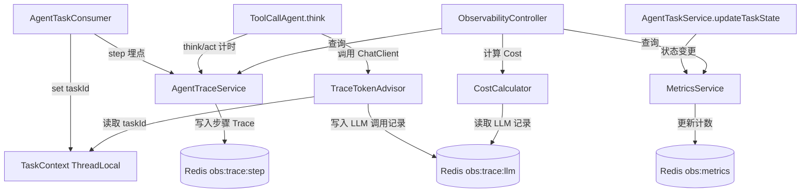

## 用户需求

根据 `future.md` 3.1 架构总览中的**可观测性层（Observability Layer）**，为 axin-agent 项目补全生产级可观测能力。

## 产品概述

在现有仅有 `LogAdvisor` 简单日志的基础上，构建完整的可观测性层，覆盖四大维度：

- **链路追踪（Trace）**：记录每次 Agent 运行中每步 Think/Act 的耗时、Token 用量、工具调用信息
- **Token & Cost 统计**：每次 LLM 调用的 promptTokens / completionTokens，以及估算费用，支持按任务汇总
- **性能指标（Metrics）**：工具调用成功率、Agent 任务完成率、P95 响应时间
- **结构化查询 API**：提供 REST 接口查询指定任务的完整 Trace、全局 Metrics、任务 Cost 明细

## 核心功能

- **TraceTokenAdvisor**：Spring AI Advisor，拦截每次 ChatClient 同步调用，采集耗时和 Token 用量，写入 Redis
- **AgentTraceService**：封装 Agent 步骤级别的 Trace 数据写入与读取，每步记录 type(THINK/ACT)、耗时、是否成功、工具名、摘要
- **MetricsService**：维护全局任务统计（总数/完成/失败）和工具调用统计（总数/成功/失败），支持 P95 响应时间计算
- **AgentTaskConsumer 增强**：在 `buildProgressAwareAgent` 的 step() 埋点，记录每步开始/结束时间
- **ToolCallAgent 增强**：在 `think()` 和 `act()` 前后埋点，将计时和结果传给 TraceService
- **ObservabilityController**：提供三个查询端点：任务 Trace 详情、全局 Metrics 统计、任务 Cost 汇总
- **ObservabilityConfig**：集中配置 Redis Key 常量，与 `RocketMqConfig` 风格一致

## 技术栈

- **存储层**：复用现有 `StringRedisTemplate`（Redis 192.168.60.131:8321），无需引入新 DB
- **序列化**：JSON（Jackson，Spring Boot 已有），将 TraceEntry / LlmCallRecord 序列化存 Redis List
- **指标采集**：纯代码计算，不引入 Micrometer/Actuator（保持轻量，与项目现有风格一致）
- **Advisor 机制**：复用 Spring AI `CallAdvisor` 接口，参考 `LogAdvisor.java` 实现模式
- **依赖新增**：`jackson-databind`（Spring Boot Web 已传递，无需额外声明），`spring-boot-starter-actuator`（可选，仅用于 /health，不强依赖）

## 实现方案

### 整体思路

采用**分层埋点**策略：

1. **LLM 调用层**：`TraceTokenAdvisor` 拦截 `ChatClient.call()`，读取 `ChatResponse.getMetadata().getUsage()` 获取 Token 数，计算耗时，通过 `ThreadLocal<String> taskIdHolder` 关联当前 taskId 后写入 Redis
2. **Agent 步骤层**：在 `AgentTaskConsumer.buildProgressAwareAgent()` 的匿名子类 step() 中埋点，调用 `AgentTraceService.recordStep()`
3. **工具调用层**：在 `ToolCallAgent.act()` 前后计时，记录工具名称和成功/失败
4. **统计汇总层**：`MetricsService` 在任务状态变更时更新全局计数器

### TaskId 传递机制

使用 `TaskContext`（`ThreadLocal<String>`）在同一线程内传递 taskId，`AgentTaskConsumer` 在任务开始时 set，结束时 remove，`TraceTokenAdvisor` 从中读取当前 taskId。

### Redis 数据结构设计

| Key | 类型 | 说明 |
| --- | --- | --- |
| `obs:trace:step:{taskId}` | List | Agent 步骤 Trace（JSON），每步一条 |
| `obs:trace:llm:{taskId}` | List | LLM 调用记录（JSON），含 Token/耗时 |
| `obs:metrics:task` | Hash | 全局任务计数（total/finished/error/cancelled） |
| `obs:metrics:tool:{toolName}` | Hash | 工具调用统计（total/success/fail） |
| `obs:metrics:latency` | List | 所有 LLM 调用耗时（毫秒，用于 P95 计算） |


TTL 与 `RocketMqConfig.REDIS_TTL_SECONDS`（1小时）一致，任务级 key 跟随任务生命周期。

### Cost 估算

DashScope qwen-turbo 价格：

- 输入：0.004 元/千 token
- 输出：0.012 元/千 token

在 `ObservabilityConfig` 中定义常量，可配置化，避免硬编码。

### 性能影响控制

- `TraceTokenAdvisor` 仅执行 Redis RPUSH，为 O(1) 操作，对 LLM 调用耗时影响忽略不计
- P95 计算在查询时进行，不影响写入热路径
- 所有 Redis 写入均为非阻塞追加，不影响 Agent 执行主流程

## 架构图



## 目录结构

```
src/main/java/com/axin/axinagent/
├── advisor/
│   ├── LogAdvisor.java                     [已有]
│   └── TraceTokenAdvisor.java              [NEW] LLM调用拦截Advisor。实现CallAdvisor接口（参考LogAdvisor），在adviseCall前后记录耗时，从ChatResponse.getMetadata().getUsage()读取promptTokens/completionTokens，从TaskContext读取当前taskId，构造LlmCallRecord写入Redis obs:trace:llm:{taskId} 和 obs:metrics:latency。
│
├── observability/
│   ├── model/
│   │   ├── TraceStepEntry.java             [NEW] Agent步骤Trace数据模型。字段：taskId, step, type(THINK/ACT), startTime, endTime, durationMs, toolName(可空), success, summary(截取前200字), tokenUsage。
│   │   ├── LlmCallRecord.java              [NEW] LLM单次调用记录数据模型。字段：taskId, callTime, durationMs, promptTokens, completionTokens, totalTokens, model。
│   │   ├── TaskTraceResult.java            [NEW] 任务完整Trace查询结果VO。包含taskId、步骤列表(List<TraceStepEntry>)、LLM调用列表(List<LlmCallRecord>)、汇总统计(totalDurationMs/totalTokens/estimatedCostYuan)。
│   │   ├── MetricsResult.java              [NEW] 全局Metrics统计VO。包含任务统计(total/finished/error/cancelled/completionRate)、工具统计Map、P95响应时间(ms)。
│   │   └── ToolMetrics.java                [NEW] 单工具统计VO。字段：toolName, total, success, fail, successRate。
│   │
│   ├── TaskContext.java                    [NEW] ThreadLocal工具类，用于在同一线程内传递taskId（Advisor和Service之间无需显式参数传递）。提供set/get/remove静态方法。
│   ├── AgentTraceService.java              [NEW] Agent步骤Trace写入与读取服务。recordStep()在每步执行前后被调用，将TraceStepEntry序列化为JSON写入Redis List；getTaskTrace()读取并反序列化完整Trace；recordToolCall()更新工具成功/失败计数器。
│   ├── MetricsService.java                 [NEW] 全局指标统计服务。incrTaskTotal/incrTaskFinished/incrTaskError()在任务状态变更时调用；getMetrics()汇总读取全局统计并计算P95（对obs:metrics:latency List排序取分位数）；工具级统计委托AgentTraceService。
│   └── CostCalculator.java                 [NEW] Token费用估算工具类。根据promptTokens/completionTokens和DashScope价格常量估算人民币费用，价格常量定义在ObservabilityConfig中，支持未来替换。
│
├── config/
│   ├── RocketMqConfig.java                 [已有]
│   └── ObservabilityConfig.java            [NEW] 可观测性Redis Key常量和价格常量配置。定义所有obs:前缀Key模板、TTL、DashScope token单价(INPUT_PRICE_PER_1K/OUTPUT_PRICE_PER_1K)。风格与RocketMqConfig一致（常量类，私有构造）。
│
├── controller/
│   ├── AiController.java                   [已有]
│   └── ObservabilityController.java        [NEW] 可观测性查询REST控制器。三个端点：GET /observability/trace/{taskId}（返回TaskTraceResult）、GET /observability/metrics（返回MetricsResult）、GET /observability/cost/{taskId}（返回任务Cost摘要）。注解Knife4j文档。
│
├── agent/
│   ├── AxinManus.java                      [MODIFY] 在构建ChatClient时注入TraceTokenAdvisor，与LogAdvisor并列添加到defaultAdvisors中。
│   ├── ToolCallAgent.java                  [MODIFY] 在think()和act()前后添加计时，调用AgentTraceService.recordStep()记录TraceStepEntry；act()中记录工具名称和调用结果（成功/失败）。
│   └── BaseAgent.java                      [MODIFY] run()方法在执行开始前设置TaskContext（若无taskId则用随机UUID），在finally中清理TaskContext，确保即使直连调用（非RocketMQ）也有Trace能力。
│
└── task/
    ├── AgentTaskConsumer.java              [MODIFY] 在buildProgressAwareAgent中注入AgentTraceService；onMessage开始时调用TaskContext.set(taskId)，finally中调用TaskContext.remove()；任务状态变更时调用MetricsService计数。
    └── AgentTaskService.java               [MODIFY] updateTaskState()在状态为FINISHED/ERROR/CANCELLED时，调用MetricsService对应的计数方法（incrTaskFinished/incrTaskError/incrTaskCancelled），实现任务完成率统计。
```