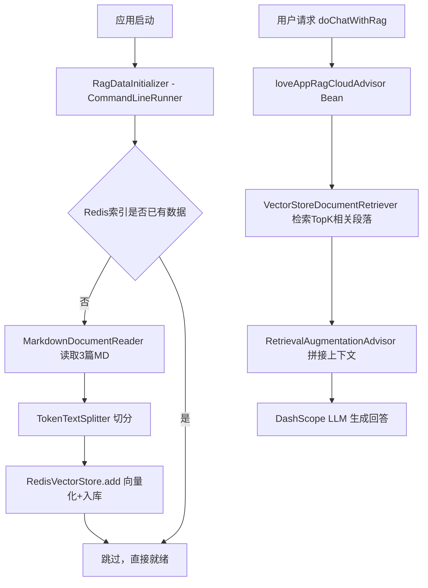

## 用户需求

基于现有 Spring AI Alibaba 项目，将当前依赖阿里云远程知识库（DashScopeDocumentRetriever）的 RAG 方案，替换为本地 Redis Stack 向量数据库方案。将 `resources/document/` 下三篇恋爱话题 Markdown 文档加载、切分、向量化后存入 Redis，并通过 `RetrievalAugmentationAdvisor` 对 `LoveApp.doChatWithRag` 提供本地 RAG 增强问答能力。

## 产品概述

- 三篇 MD 文档（单身篇、恋爱篇、已婚篇）作为本地知识库来源
- 使用 DashScope EmbeddingModel 生成向量，Redis Stack 作为本地向量存储
- 应用启动时自动完成文档加载与向量化（幂等，避免重复入库）
- `LoveApp.doChatWithRag` 调用时通过 Advisor 检索相关文档段落，增强模型回答质量

## 核心功能

- **文档加载与切分**：读取三篇 Markdown 文件，按段落 Token 切分为适合检索的 Document 块
- **向量入库（幂等初始化）**：应用启动后执行一次文档向量化并存入 Redis，已有数据则跳过
- **本地 RAG Advisor**：替换现有 `LoveAppRagCloudAdvisor`，使用 `RedisVectorStore` + `VectorStoreDocumentRetriever` 构建 `RetrievalAugmentationAdvisor`
- **配置驱动**：Redis 连接地址、索引名、前缀等均通过 `application.yml` 配置

## 技术栈

- **框架**：Spring Boot 3.5.12 + Spring AI Alibaba 1.1.2.0（已有）
- **向量存储**：Spring AI Redis Vector Store（`spring-ai-starter-vector-store-redis`，自动配置）
- **Embedding**：DashScope EmbeddingModel（`spring-ai-alibaba-starter-dashscope` 已包含，无需新增）
- **文档处理**：Spring AI `MarkdownDocumentReader` + `TokenTextSplitter`
- **向量数据库**：Redis Stack（需本地启动 Docker 容器，默认端口 6379）

---

## 实现思路

整体采用"自动配置 + CommandLineRunner 幂等初始化 + Advisor 检索"三段式架构：

1. `pom.xml` 引入 `spring-ai-starter-vector-store-redis`，触发 Spring Boot 自动配置，自动创建 `RedisVectorStore` Bean
2. `RagDataInitializer` 实现 `CommandLineRunner`，启动时检查 Redis 索引是否已有数据，若无则加载三篇 MD → 切分 → 向量化写入
3. `LoveAppRagCloudAdvisor` 直接注入自动配置的 `VectorStore` Bean，构建 `RetrievalAugmentationAdvisor`，Bean 名保持不变，`LoveApp` 零改动



### 关键技术决策

1. **使用自动配置 starter**：`spring-ai-starter-vector-store-redis` 自动创建 `RedisVectorStore` Bean，无需手动声明 `JedisPooled`，与项目现有 Spring Boot 自动配置风格一致
2. **幂等初始化**：`RagDataInitializer` 通过 `vectorStore.similaritySearch` 发送探测查询，若返回非空则说明已入库，跳过初始化，防止重启后重复向量化和 embedding API 浪费
3. **保持 Bean 名不变**：`LoveAppRagCloudAdvisor.java` 中 `@Bean` 方法名保持 `loveAppRagCloudAdvisor`，`LoveApp.java` 的 `@Resource` 注入无需任何改动
4. **文档切分策略**：`TokenTextSplitter` 使用 chunkSize=800、overlap=400，适合中文问答类检索，保持上下文连贯性

### 实现细节

- Redis Stack 启动命令：`docker run -d -p 6379:6379 redis/redis-stack:latest`（普通 Redis 不支持向量搜索，必须用 Redis Stack）
- `spring-ai-starter-vector-store-redis` 版本需与当前 Spring AI Alibaba 1.1.2.0 对应的 Spring AI 版本（1.0.0）对齐，避免依赖冲突
- `initialize-schema: true` 必须显式配置，默认为 false
- `MarkdownDocumentReader` 通过 `ClassPathResource` 加载，文件名含中文需注意编码，使用 `ResourceUtils.getFile` 或直接 `new ClassPathResource` 均可
- `LoveAppRagCloudAdvisor` 中注入 `VectorStore`（接口类型），而非具体 `RedisVectorStore`，保持代码解耦

---

## 目录结构

```
axin-agent/
├── pom.xml                                              # [MODIFY] 新增 spring-ai-starter-vector-store-redis 依赖
└── src/main/
    ├── java/com/axin/axinagent/
    │   ├── advisor/
    │   │   └── LoveAppRagCloudAdvisor.java              # [MODIFY] 替换为 RedisVectorStore 本地检索 Advisor，保持Bean名不变
    │   └── rag/
    │       └── RagDataInitializer.java                  # [NEW] CommandLineRunner，启动时幂等加载MD文档写入Redis
    └── resources/
        └── application.yml                             # [MODIFY] 新增 Redis 连接及 vectorstore 配置
```

### 各文件说明

**`pom.xml`** `[MODIFY]`
新增 Redis Vector Store starter 依赖，版本对齐 Spring AI 1.0.0：

```xml
<dependency>
    <groupId>org.springframework.ai</groupId>
    <artifactId>spring-ai-starter-vector-store-redis</artifactId>
    <version>1.0.0</version>
</dependency>
```

**`application.yml`** `[MODIFY]`
新增 Redis 连接配置和 vectorstore 配置节：

```
spring:
  data:
    redis:
      host: localhost
      port: 6379
  ai:
    vectorstore:
      redis:
        initialize-schema: true
        index-name: love-app-rag
        prefix: love:embedding:
```

**`advisor/LoveAppRagCloudAdvisor.java`** `[MODIFY]`

- 移除 DashScopeApi、DashScopeDocumentRetriever 等阿里云检索相关代码
- 注入自动配置的 `VectorStore` Bean
- 使用 `VectorStoreDocumentRetriever` + `RetrievalAugmentationAdvisor` 构建本地检索 Advisor
- `@Bean` 方法名保持 `loveAppRagCloudAdvisor`，确保 `LoveApp` 零改动

**`rag/RagDataInitializer.java`** `[NEW]`

- 实现 `CommandLineRunner`，应用启动时自动执行
- 注入 `VectorStore`，通过探测查询实现幂等保护
- 使用 `MarkdownDocumentReader` 分别读取三篇 MD（单身篇、恋爱篇、已婚篇）
- 使用 `TokenTextSplitter`（chunkSize=800, overlap=400）切分文档
- 调用 `vectorStore.add()` 批量写入，打印详细入库日志