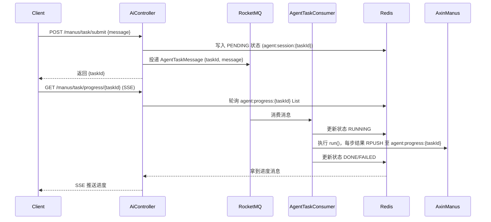
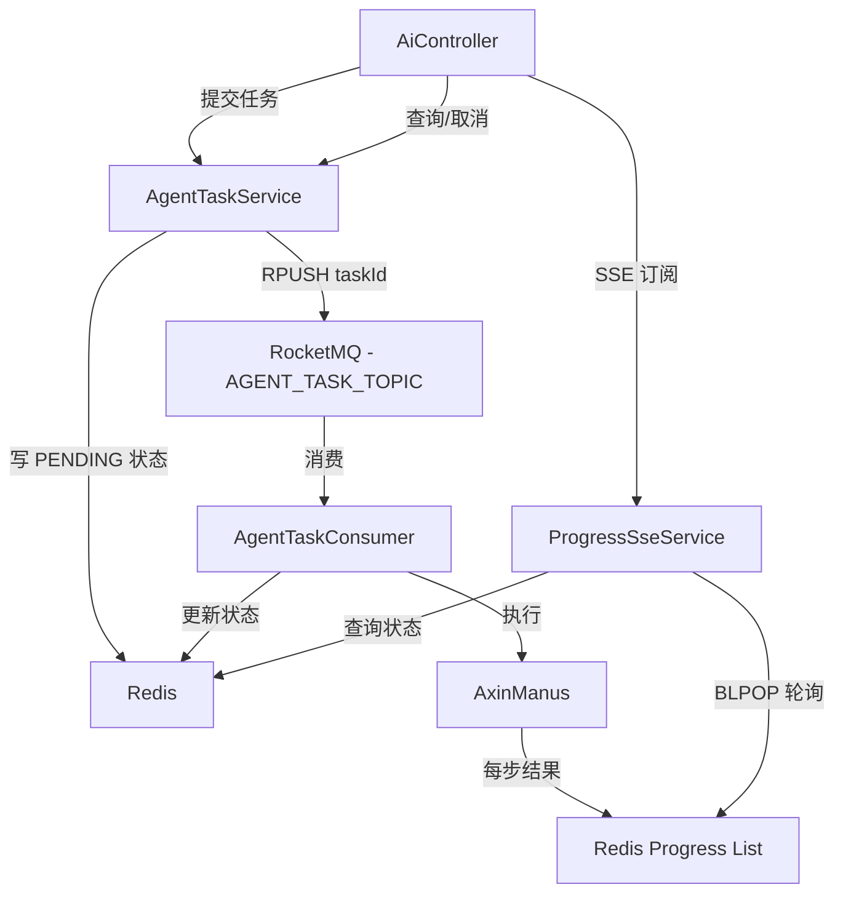

## 用户需求

完成 `future.md` 3.1 中描述的**任务调度层**，将当前同步阻塞的 Agent 执行模式改造为异步任务队列驱动模式，任务队列使用 **RocketMQ**。

## 产品概述

当前 `AiController.doChatWithManus()` 每次请求都 `new AxinManus(...)` 同步执行，任务中断后无法恢复。改造后：HTTP 请求立即返回 `taskId`，Agent 异步执行，前端通过 SSE 长连接订阅实时进度，并支持查询任务状态和取消任务。

## 核心功能

### 1. 任务状态机扩展

- 扩展 `AgentState` 枚举：`PENDING → RUNNING → PAUSED → DONE / FAILED / TIMEOUT`

### 2. 任务提交接口

- `POST /ai/manus/task/submit`：接收用户消息，生成 `taskId`，投递消息到 RocketMQ，立即返回 `{ taskId }`

### 3. RocketMQ 异步消费

- 消费者监听 Agent 任务 Topic，从 Redis 恢复或新建 `AgentSession`，执行 `AxinManus.run()`，将每步结果推送至 Redis List（消息队列缓冲），任务完成后更新状态

### 4. 会话管理（Redis 持久化）

- `AgentSession`：包含 `taskId`、`sessionId`、`state`、`messageList`、`progress` 等字段，序列化存储于 Redis（key: `agent:session:{taskId}`）

### 5. 任务进度 SSE 订阅

- `GET /ai/manus/task/progress/{taskId}`：SSE 接口，服务端轮询 Redis 进度缓冲，将每步结果推送给前端，任务完成/失败时关闭连接

### 6. 任务状态查询与取消

- `GET /ai/manus/task/status/{taskId}`：返回任务当前状态
- `POST /ai/manus/task/cancel/{taskId}`：将任务标记为取消，消费端检测后停止执行

## 技术栈

- **Spring Boot 3.5.12** + **Java 21**（沿用现有栈）
- **RocketMQ**：`rocketmq-spring-boot-starter 2.3.1`（Apache RocketMQ 5.x 兼容）
- **Redis**：已有 `spring-boot-starter-data-redis`，用于会话持久化和进度缓冲
- **Jackson / Kryo**：已有 Kryo 依赖，Session 序列化使用 JSON（`ObjectMapper`）更通用，消息体使用 Jackson
- **Lombok**：已有，继续使用
- **SSE**：沿用现有 `SseEmitter` 方案

---

## 实现思路

### 整体异步化改造流程



### 关键设计决策

1. **RocketMQ 而非 Kafka/RabbitMQ**：用户明确指定，`rocketmq-spring-boot-starter` 与 Spring Boot 3.x 集成成熟
2. **进度缓冲用 Redis List**：`RPUSH` 写入、`BLPOP`/`LRANGE` 消费，天然支持进度回放；SSE 侧用定时轮询（100ms 间隔），避免 Redis pub/sub 的连接资源问题
3. **会话状态用 Redis Hash**：`agent:session:{taskId}` 存 taskId/state/createTime/message，TTL 1小时，轻量且支持原子更新
4. **`messageList` 序列化**：当前 Agent 执行是单次同步任务，`messageList` 不跨请求持久化（保留扩展点），避免序列化 Spring AI Message 对象的兼容问题
5. **取消机制**：在 Redis 写入 `agent:cancel:{taskId}=1` 标记，消费端每步执行前检测，实现协作式取消（不强杀线程）
6. **向后兼容**：保留原有 `/ai/manus/chat` 接口不变，新增 `/ai/manus/task/**` 系列接口

---

## 架构组件关系



---

## 目录结构

```
src/main/java/com/axin/axinagent/
├── agent/
│   └── model/
│       └── AgentState.java          # [MODIFY] 新增 PENDING/PAUSED/TIMEOUT/CANCELLED 状态
├── task/
│   ├── model/
│   │   ├── AgentTaskMessage.java    # [NEW] RocketMQ 消息体：taskId、message、sessionId
│   │   ├── AgentTaskStatus.java     # [NEW] 任务状态 VO：taskId、state、createTime、message
│   │   └── TaskSubmitResponse.java  # [NEW] 提交接口响应：taskId
│   ├── AgentTaskService.java        # [NEW] 任务提交、状态查询、取消；操作 Redis + 发送 MQ 消息
│   ├── AgentTaskConsumer.java       # [NEW] RocketMQ 消费者；消费消息、执行 AxinManus、写进度缓冲
│   └── ProgressSseService.java      # [NEW] SSE 进度推送服务；轮询 Redis Progress List 推送给前端
├── controller/
│   └── AiController.java            # [MODIFY] 新增 /manus/task/** 系列接口（submit/status/progress/cancel）
├── config/
│   └── RocketMqConfig.java          # [NEW] RocketMQ Topic 常量 + Producer/Consumer Bean 配置（如需自定义）
└── ...

src/main/resources/
└── application.yml                  # [MODIFY] 新增 rocketmq.name-server 配置

pom.xml                              # [MODIFY] 新增 rocketmq-spring-boot-starter 依赖
```

---

## 关键代码结构

```java
// AgentTaskMessage.java - MQ 消息体
@Data
public class AgentTaskMessage implements Serializable {
    private String taskId;      // UUID
    private String message;     // 用户原始输入
    private long createTime;    // 创建时间戳
}

// AgentTaskStatus.java - 状态查询响应
@Data
public class AgentTaskStatus {
    private String taskId;
    private String state;       // AgentState.name()
    private String message;     // 原始用户消息
    private long createTime;
}
```

```java
// AgentTaskConsumer - 消费者核心逻辑（伪代码）
@RocketMQMessageListener(topic = "AGENT_TASK_TOPIC", consumerGroup = "axin-agent-consumer")
public class AgentTaskConsumer implements RocketMQListener<AgentTaskMessage> {
    @Override
    public void onMessage(AgentTaskMessage msg) {
        // 1. 更新 Redis state = RUNNING
        // 2. new AxinManus(allTools, chatModel)，重写 step() 在每步执行后 RPUSH 进度
        // 3. 执行 run()，每步将结果写入 agent:progress:{taskId}
        // 4. 每步前检测 agent:cancel:{taskId}，若存在则抛出取消异常
        // 5. 完成后更新 state = DONE / FAILED，写入结束标记
    }
}
```

## Agent Extensions

### SubAgent

- **code-explorer**
- Purpose: 在实现阶段深入探索 AxinManus、BaseAgent、Redis 配置等多文件之间的依赖关系，确保消费者中正确构建 AxinManus 实例并集成进度推送逻辑
- Expected outcome: 精准定位所有需要修改的文件及其调用链，避免遗漏依赖注入或构造器参数问题