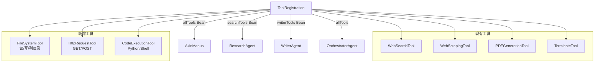

## 用户需求

根据 `future.md` 第 3.1 节架构总览中的工具层定义，完善当前工具层，使其达到生产级最低标准。

## 产品概述

在现有 4 个工具（WebSearch、WebScraping、PDFGeneration、Terminate）基础上，按照 3.1 架构图工具层描述及 5.2 中期规划，扩展为覆盖文件系统操作、HTTP 请求调用、代码执行三类新工具，并同步更新 ToolRegistration 注册配置，将新工具集成到 AxinManus（全能 Agent）和 OrchestratorAgent 的工具分发体系中。

## 核心功能

### 新增工具（3 个）

1. **文件系统工具 FileSystemTool**

- 读取文件内容（指定文件路径，返回文本，超长截断）
- 写入文件内容（指定路径和内容，目录不存在则自动创建）
- 列出目录内容（列出指定目录下的文件/子目录名称列表）
- 安全边界：限制在工作目录 `./workspace/` 下，防止路径穿越

2. **HTTP 请求工具 HttpRequestTool**

- GET 请求（URL + 可选 Header，返回响应体，超长截断）
- POST 请求（URL + JSON Body + 可选 Header，返回响应体）
- 统一超时控制和错误处理

3. **代码执行工具 CodeExecutionTool**

- 执行 Python 代码片段（本地 Python 进程，超时 30 秒）
- 执行 Shell/PowerShell 命令（本地进程，超时 30 秒）
- 输出长度截断（maxLength=3000），防止 token 爆炸
- 安全说明注释（生产环境建议替换为 Docker 沙箱）

### 配置更新

- `ToolRegistration.java`：注册三个新工具，向 `allTools` Bean 中加入，同时暴露工具分组 Bean（`searchTools`、`writerTools`、`fileTools`）供 OrchestratorAgent 按需取用
- `OrchestratorAgent.java`：WRITER_TOOL_NAMES 新增文件系统相关工具名，使 WriterAgent 具备文件读写能力
- `future.md`：更新工具层条目状态为已完成

## 技术栈

- **语言/框架**：Java 21 + Spring Boot 3.5 + Spring AI 1.1.2
- **工具注解**：`@Tool` + `@ToolParam`（Spring AI 标准，与现有工具完全一致）
- **HTTP 工具**：hutool-all 5.8.37（已有依赖，`HttpUtil`/`HttpRequest`）
- **文件工具**：hutool-all `FileUtil`（已有，与 PDFGenerationTool 同款）
- **代码执行**：Java 标准库 `ProcessBuilder`（无需新增依赖）
- **新增依赖**：无需引入新 Maven 依赖，hutool 已覆盖 HTTP 和文件操作需求

## 实现方案

### 总体策略

完全复用现有工具架构模式：POJO 类 + `@Tool`/`@ToolParam` 注解 + 在 `ToolRegistration` 中手动实例化并通过 `ToolCallbacks.from()` 注册。不引入新框架，不改变 Spring Bean 结构。

### 各工具设计决策

**FileSystemTool**

- 采用沙箱路径限制：所有操作限定在 `{user.dir}/workspace/` 目录下，路径规范化后校验前缀，防止 `../` 路径穿越
- 读取文件使用 `FileUtil.readUtf8String()`，超过 3000 字符截断
- 写入文件使用 `FileUtil.writeUtf8String()`，自动 `FileUtil.mkdir()` 创建目录
- 列目录返回文件名列表字符串，格式化友好

**HttpRequestTool**

- 复用 hutool `HttpUtil.get()` 和 `HttpRequest.post()`，与 `WebSearchTool` 实现风格保持一致
- 超时统一设为 15 秒，响应体截断 5000 字符（HTTP 响应通常比网页大）
- Header 参数设计为可选字符串（`key:value,key:value` 格式），便于 LLM 传参
- POST body 直接传 JSON 字符串，`Content-Type: application/json`

**CodeExecutionTool**

- 使用 `ProcessBuilder` 启动子进程，`redirectErrorStream(true)` 合并 stdout/stderr
- Python 执行：将代码写入临时文件 `tmp/code/tmp_xxx.py`，执行 `python tmp_xxx.py`，执行完删除临时文件
- Shell 执行：Windows 使用 `cmd /c`，Linux 使用 `bash -c`，通过 `System.getProperty("os.name")` 自动判断
- 超时 30 秒，`Process.waitFor(30, TimeUnit.SECONDS)`，超时则 `destroyForcibly()`
- 代码注释中明确标注"生产环境建议 Docker 隔离"，满足 future.md 5.2 描述

### ToolRegistration 更新策略

新增三个工具实例加入 `allTools` Bean 数组，同时增加两个分组 Bean：

- `searchTools`：WebSearch + WebScraping + Terminate（供 ResearchAgent）
- `writerTools`：PDFGeneration + FileSystem + Terminate（供 WriterAgent，新增文件系统读写能力）

OrchestratorAgent 的 `WRITER_TOOL_NAMES` 列表同步新增 `fileSystemTool`。

### 性能与可靠性

- 所有工具异常均 catch 后返回错误字符串（与现有 WebSearchTool 模式一致），不抛出受检异常给 LLM
- 超时控制防止 Agent 阻塞在 HTTP/进程调用
- 文件大小/输出长度截断防止 token 消耗爆炸

## 架构设计



## 目录结构

```
src/main/java/com/axin/axinagent/tool/
├── WebSearchTool.java          # [已有] 不变
├── WebScrapingTool.java        # [已有] 不变
├── PDFGenerationTool.java      # [已有] 不变
├── TerminateTool.java          # [已有] 不变
├── FileSystemTool.java         # [NEW] 文件系统工具：readFile/writeFile/listDirectory 三个 @Tool 方法，沙箱限制在 ./workspace/ 目录
├── HttpRequestTool.java        # [NEW] HTTP 请求工具：httpGet/httpPost 两个 @Tool 方法，基于 hutool HttpUtil，超时15s，响应截断5000字符
├── CodeExecutionTool.java      # [NEW] 代码执行工具：executePython/executeShell 两个 @Tool 方法，ProcessBuilder实现，超时30s，输出截断3000字符
└── ToolRegistration.java       # [MODIFY] 新增三个工具实例注册到 allTools；新增 searchTools/writerTools 分组 Bean

src/main/java/com/axin/axinagent/agent/
└── OrchestratorAgent.java      # [MODIFY] WRITER_TOOL_NAMES 列表新增 "fileSystemTool"

future.md                       # [MODIFY] 工具层条目更新状态
```

## Agent Extensions

### SubAgent

- **code-explorer**
- 用途：在实现代码执行工具（CodeExecutionTool）时，探查项目中是否存在已有的进程管理或临时文件工具类，避免重复实现
- 预期结果：确认 `utils/` 目录及 demo 下无重复工具，确保新实现路径准确